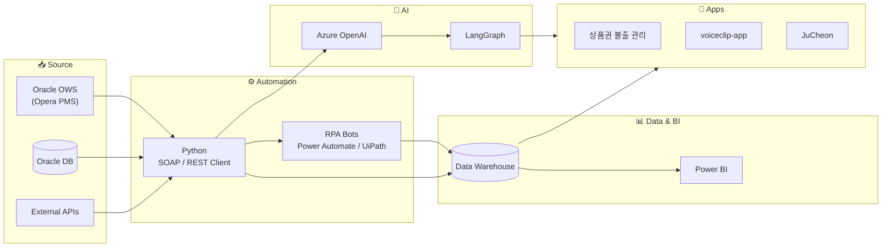

## 👋 **Hello!**

Nice to meet you. I'm K (Daehoon Kim). :)

I engineer and develop solutions in enterprise automation and AI systems.

---

## 🌐 Experience

- **Enterprise Automation Developer & AI System Engineer @ Parnas** (2023.01 ~)

  - Engineer @ GS Holdings 52g 근무 (2024.01 ~ 2024.12)

- **Developer @ DEX Consulting** (2021.06 ~ 2022.12)

  - GS Retail DCX추진팀 RPA Center 근무 (2021.10 ~ 2022.12) 

---

## 💼 Featured Projects

- **🏨 [Opera-OWS](https://github.com/eogns6357/Opera-OWS)** — Oracle Hospitality Opera PMS의 OWS(Web Service) 기반 예약/운영 업무 자동화. 수기 처리되던 예약·객실·회계 업무를 SOAP API로 자동화.

- **🎟️ 상품권 불출 관리 시스템** — 상품권 발행·불출·사용 이력을 통합 관리. 분산된 프로세스를 단일 시스템으로 표준화하고 잔여 재고 실시간 추적.

- **🌐 [voiceclip-app](https://github.com/eogns6357/voiceclip-app)** — 다국적 고객 응대를 위한 음성 기반 실시간 번역 애플리케이션. 음성 인식 → 번역 → 음성 출력.

- **📈 [JuCheon](https://github.com/eogns6357/JuCheon)** — 시장 데이터 분석 기반 주식 추천 시스템. 종목 데이터 수집과 지표 기반 필터링.

- **📊 BI & 대시보드** — Power BI 기반 매출/객실 가동률/예약 추이 대시보드. KPI 실시간 가시화와 권한별 뷰 설계.

- **🤖 RPA 워크플로우** — Power Automate(Desktop & Cloud)와 UiPath 기반 반복 업무 자동화 봇 구축.

- **🎓 AI 교육 프로그램** — 사내 비개발 직군 포함 전사 대상 LLM 활용 교육. 프롬프트 엔지니어링, 업무 활용 사례, 보안 가이드.

- **🔗 [langgraph](https://github.com/eogns6357/langgraph)** — LangGraph 기반 에이전트 시스템 연구용 포크.

---

## 🏗️ Reference Architecture

호텔 운영 자동화에서 자주 사용하는 표준 아키텍처입니다.
Oracle OWS를 중심으로 RPA, BI, AI 레이어가 유기적으로 연결됩니다.

---

## 🔗 Link

- **Instagram:** [@iamdaehoon](https://www.instagram.com/iamdaehoon/)

---

## 👋 **안녕하세요.**

Enterprise Automation & AI System Engineering을 통해 DX 경험을 만들어가는 K입니다.

## 🇰🇷 자기 소개

저는 Developer | DX Strategy 분야에서

업무 자동화, 데이터 분석, AI 기반 기능 도입, 시스템 연동을 설계·개발하고 있습니다.

Power Automate 기반 RPA, Power BI 분석, Azure OpenAI 활용,

Oracle OWS API 통합 등 엔터프라이즈 환경에 필요한 기술을 다루고 있습니다.

업무 흐름을 구조적으로 재해석하고, 불필요한 단계를 제거하며,

사용자 중심의 자동화와 데이터 흐름을 설계하는 방식으로 DX를 추진하고 있습니다.

---

### 🛠️ Tech Stack

**Languages & Runtime**

**Automation & RPA**

**Data & BI**

**AI & LLM**

**Enterprise Systems**

---

### 💡 Working Philosophy

1. 워크플로우를 먼저 이해한다 — 자동화는 그 다음이다
2. 자동화 가능한 것만 자동화한다 — 사람이 더 잘하는 일은 사람에게
3. 데이터를 신뢰할 수 있게 만든다 — 대시보드의 정확성이 곧 의사결정의 질
4. AI는 도구다 — 문제 정의가 더 중요하다

---

### 📊 GitHub Stats

---

⭐ From [K](https://github.com/eogns6357)
